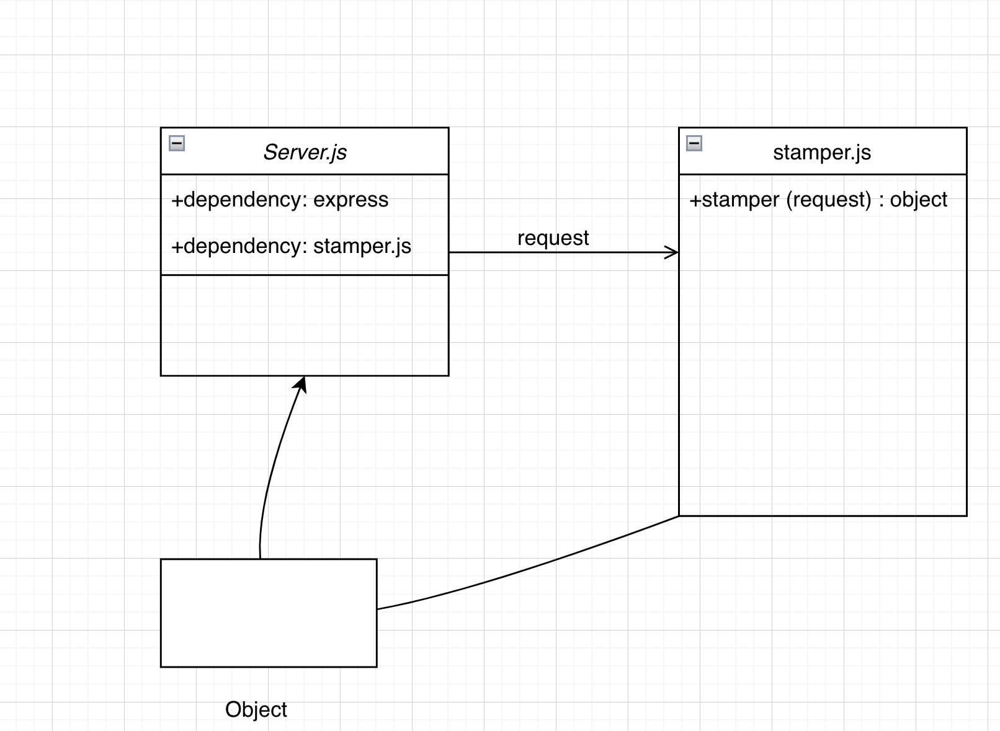

## LAB - 02
###  Basic Express Server
#### Author: A. Agabekian

https://basic-express-server-nh8h.onrender.com
https://github.com/agabekian/basic-express-server
#### Setup
.env requirements 

* PORT - Port Number

#### Running the app
* npm start
* Endpoint: /people \<name\>
  * Returns Object

Tests
* Unit Tests: npm run test

### UML

